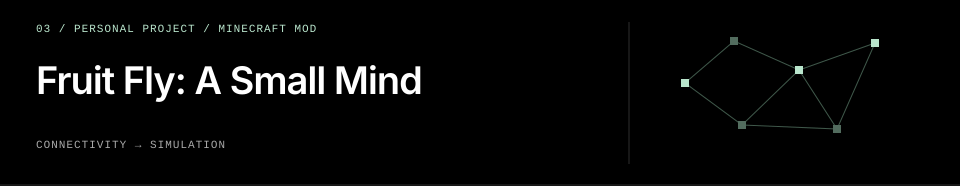
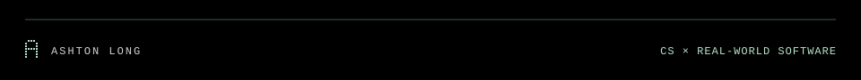

<!--
  Profile README. The images under assets/ are generated by assets/generate.py.
  Edit the text there and re-run it instead of hand-editing the SVGs.
  The contribution snake is rebuilt by .github/workflows/snake.yml on every push.
-->

 

 

## About me

I'm a fourth-year Computer Science co-op student at the University of Guelph. Since May I've been a contract developer at ScanAir, building a drone mission planner: a FastAPI backend, a React and TypeScript frontend on Mapbox GL, and a Python geometry engine that turns a scan area into DJI-compatible waypoint missions. Before that I did a co-op term at Ontario's Ministry of Public and Business Service Delivery and Procurement, where I built a semantic search tool over past incidents so the team could find how something was fixed the last time it broke.

AnkiGPT turns a PDF or pasted notes into an Anki deck and validates every card before you see it. I write a lot of my personal code with Claude Code or Codex in the loop.

I'm looking for a software developer co-op role for my next work term. When I'm not at a keyboard I'm usually at the gym.

 

## What I work with

Python and TypeScript are what I reach for first.

  

 

## Projects

  
  

  

 

## Contributions

<picture>
  <source media="(prefers-color-scheme: dark)" srcset="https://raw.githubusercontent.com/AshtonLong/AshtonLong/output/github-snake-dark.svg" />
  <source media="(prefers-color-scheme: light)" srcset="https://raw.githubusercontent.com/AshtonLong/AshtonLong/output/github-snake.svg" />
  
</picture>

 

## Get in touch

Email me at [ashtonlonger07@gmail.com](mailto:ashtonlonger07@gmail.com) or find me on [LinkedIn](https://www.linkedin.com/in/ashton-longer/). If you're hiring for a co-op term, I'd like to hear about it.

