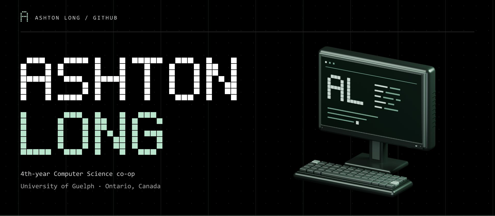

<!-- Graphics are generated by assets/generate.py. Run: python assets/generate.py. -->

<a href="https://ashtonlong.github.io/">
  <picture>
    <source media="(max-width: 600px)" srcset="assets/hero-mobile.svg" />
    
  </picture>
</a>

**[PORTFOLIO ↗](https://ashtonlong.github.io/)** &nbsp; / &nbsp; [LINKEDIN ↗](https://www.linkedin.com/in/ashton-longer/) &nbsp; / &nbsp; [EMAIL ↗](mailto:ashtonlonger07@gmail.com) &nbsp; / &nbsp; [SCANAIR ↗](https://scanair.ca)

 

## `01 /` About me

I'm a fourth-year Computer Science co-op student at the University of Guelph. Since May I've been a contract developer at ScanAir, building a drone mission planner: a FastAPI backend, a React and TypeScript frontend on Mapbox GL, and a Python geometry engine that turns a scan area into DJI-compatible waypoint missions. Before that I did a co-op term at Ontario's Ministry of Public and Business Service Delivery and Procurement, where I built a semantic search tool over past incidents so the team could find how something was fixed the last time it broke.

AnkiGPT uses an agent pipeline to turn notes and PDFs into editable Anki decks. It checks cards against the source, merges near-duplicates, audits coverage, and can rewrite struggling cards using imported Anki review history. I write a lot of my personal code with Claude Code or Codex in the loop.

I'm looking for a software developer co-op role for my next work term. When I'm not at a keyboard I'm usually at the gym.

 

## `02 /` What I work with

Python and TypeScript are what I reach for first.

| | Toolkit |
| :--- | :--- |
| **A / Languages** | Python · TypeScript · JavaScript · C · C++ · Java · HTML · CSS · R |
| **B / Frameworks** | React · FastAPI · Flask · Vite |
| **C / Tools & data** | Docker · Git · GitHub · GitHub Actions · SQLite · Redis |
| **D / Editors** | VS Code · PyCharm · IntelliJ · CLion |

 

## `03 /` Projects

<a href="https://github.com/AshtonLong/AnkiGPT">
  <picture>
    <source media="(max-width: 600px)" srcset="assets/cards/ankigpt-mobile.svg" />
    
  </picture>
</a>

Agents turn notes and PDFs into editable Anki decks. Source checks, semantic deduplication and coverage audits.

`Python` `Flask` `OpenRouter` `NumPy` `SQLite`

[View repository ↗](https://github.com/AshtonLong/AnkiGPT)

 

<a href="https://scanair.ca">
  <picture>
    <source media="(max-width: 600px)" srcset="assets/cards/scanair-mobile.svg" />
    
  </picture>
</a>

Drone mission planner. Turns a scan area into DJI-ready waypoint missions for 3D Gaussian Splatting capture, with terrain checks.

`FastAPI` `React` `TypeScript` `Mapbox GL`

[Visit ScanAir ↗](https://scanair.ca)

 

<a href="https://github.com/AshtonLong/fruitfly-brain-mod">
  <picture>
    <source media="(max-width: 600px)" srcset="assets/cards/fruitfly-brain-mod-mobile.svg" />
    
  </picture>
</a>

Fruit-fly spiking neural simulation using real FlyWire connectivity. A Minecraft Fabric mod with ecology and a live brain activity visualizer.

`Java` `Fabric` `Python`

[View repository ↗](https://github.com/AshtonLong/fruitfly-brain-mod)

 

## `04 /` Contributions

<picture>
  <source media="(prefers-color-scheme: dark)" srcset="https://raw.githubusercontent.com/AshtonLong/AshtonLong/output/github-snake-dark.svg" />
  <source media="(prefers-color-scheme: light)" srcset="https://raw.githubusercontent.com/AshtonLong/AshtonLong/output/github-snake.svg" />
  
</picture>

 

## `05 /` Get in touch

### Let's build something.

Email me at [ashtonlonger07@gmail.com](mailto:ashtonlonger07@gmail.com) or find me on [LinkedIn](https://www.linkedin.com/in/ashton-longer/). If you're hiring for a co-op term, I'd like to hear about it.

